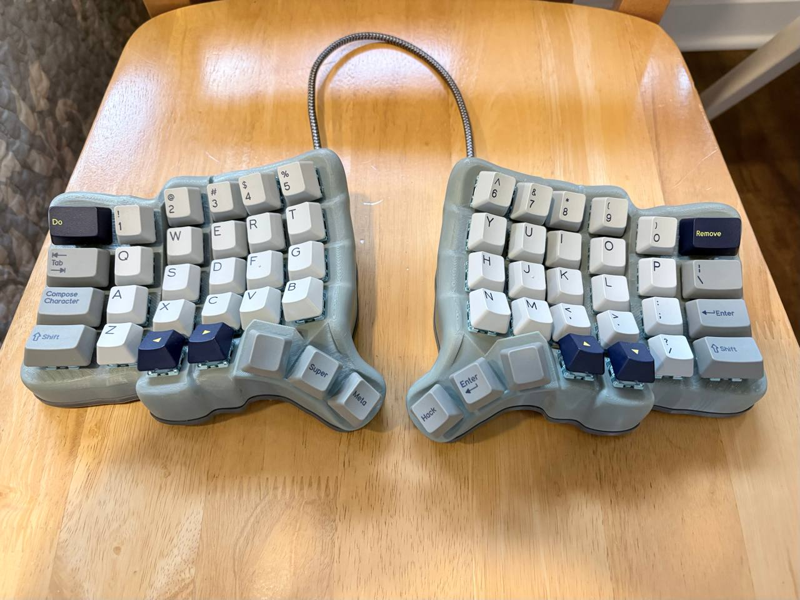
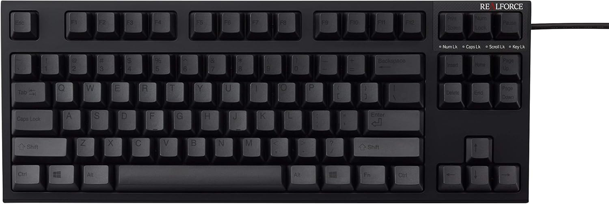
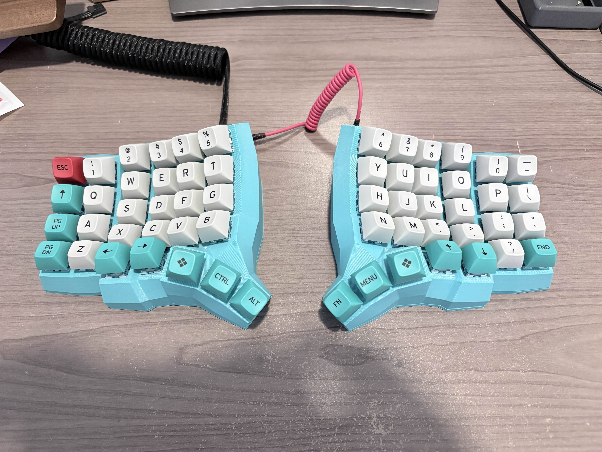
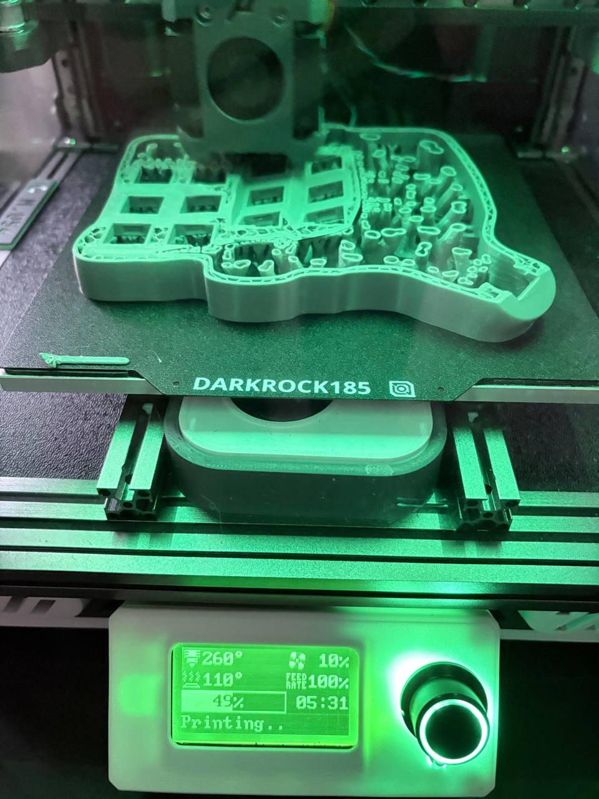
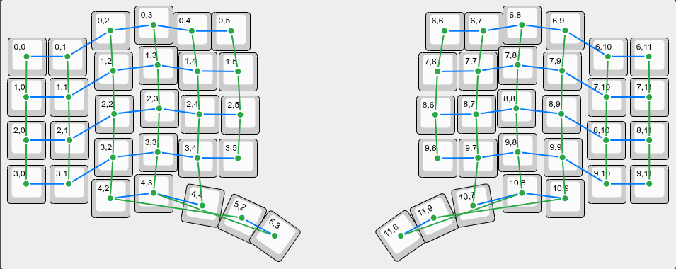
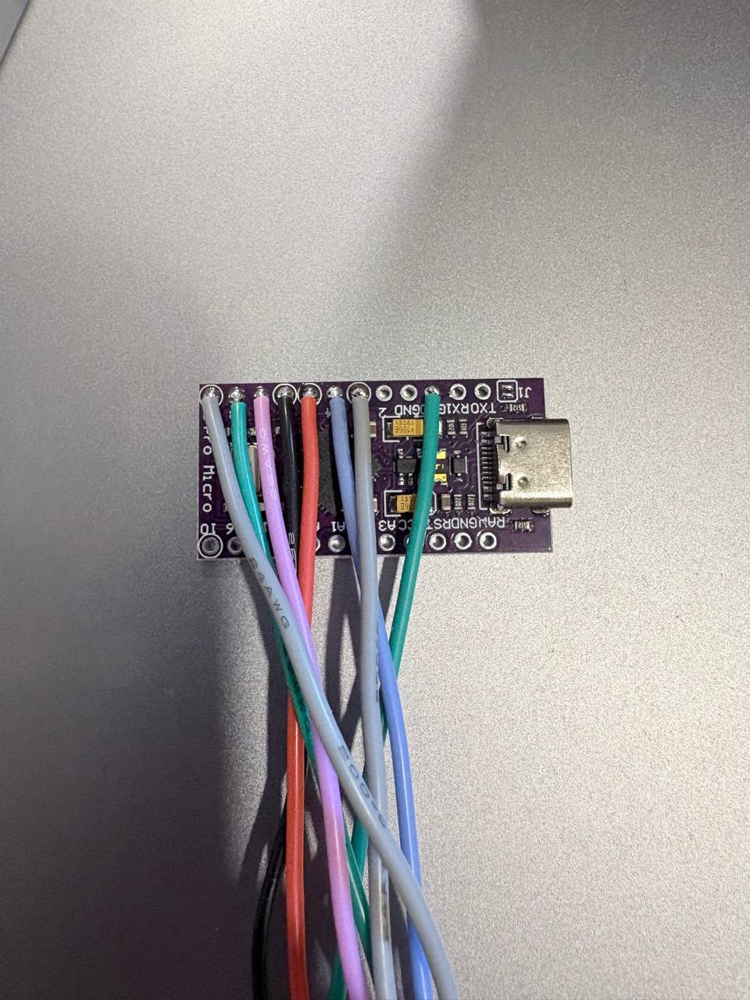
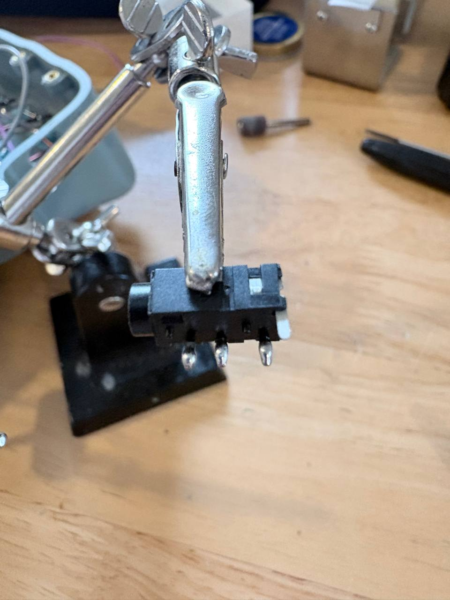
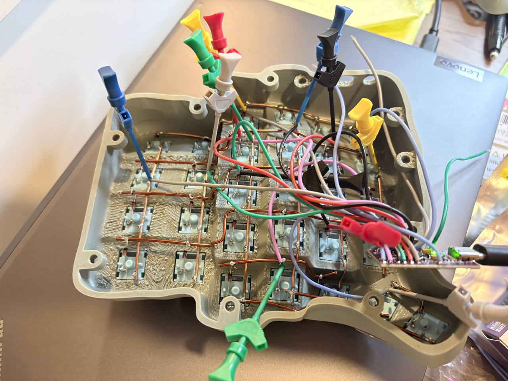
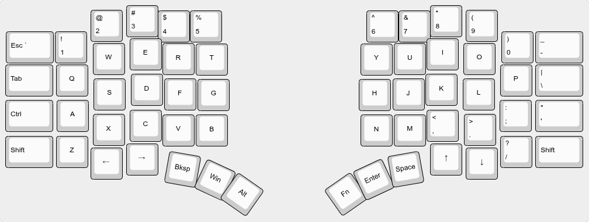
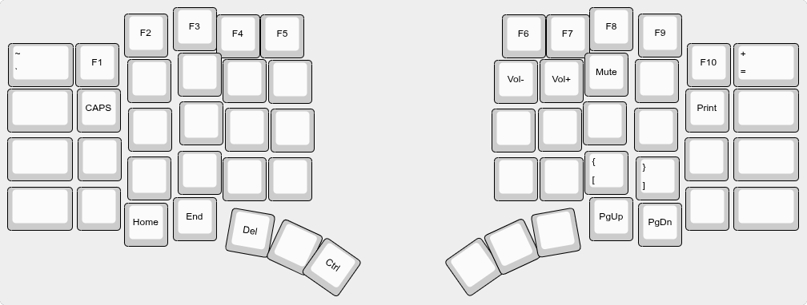

## Prelude

This is my Cosmos Dactyl Split Keyboard. There are many like it, but this one is mine. My keyboard is my best friend. It is my life. I must master it as I must master my life. My keyboard, without me, is useless. Without my keyboard, I am useless.



## Introduction

This is a build log of sorts which runs through details of building a hand-wired [Cosmos Split Keyboard](https://ryanis.cool/cosmos/). I don't go through every detail but try and cover some tips and things of note.

A Cosmos keyboard comes in many shapes and forms as it's a web site for generating a configurable [dactyl-like keyboard](https://github.com/adereth/dactyl-keyboard).

## Background - How did we get here?

In my professional career, I've used standard Qwerty keyboards with little to no thought on configuration or the options available. I will add that I have had some form of carpal tunnel and hand pain through my career that I never addressed. I just figured it was part of life.

My first foray into mechanical keyboards was a [Das Keyboard 4 Professional for Mac](https://www.daskeyboard.com/) with Cherry MX Brown switches. This is a full-sized keyboard which served me well.


I then moved to the Topre world with a [Realforce R2 PFU Limited Edition](https://www.realforce.co.jp/en/). This is a TKL keyboard that I used up until very recently when I started exploring keyboards further this year. I was one with the cup so to speak for a long time.



My first "hobbyist" level keyboard was a 65% with Topre-like switches, an AEBoards Satellite with Naevies EC switches.


I've built and bought a few more keyboards since then.. As is the keyboard way. A recent one was an Alice layout split keyboard which I also really like.

Here is my Heavy Metal 75% keyboard in stainless steel with DSS Honeywell keycaps.


At one point I tried out my first ergonomic keyboard which was a [Kinesis Advantage](https://kinesis-ergo.com/) that I borrowed from a friend. There was a lot to like about this keyboard beyond the ergonomics such as the thumb cluster and keywell. Some of the key layout adjustments I liked as well. I didn't however like it enough to be set on it.

The Kinesis Advantage is a good transitional board as it covers the basic features of a keyboard without requiring additional layers. You just need to go through the learning curve of adapting to the keyboard.

## Present day

This brings me to present day where I wanted to have a similar Kinesis experience but customized to my liking.

The Cosmos keyboard project allowed me to customize the keyboard to my liking. You get unencumbered 3D printable files which works for me as I have 2 3D printers.

**Thumb cluster**

The thumb cluster is a great idea but I found I didn't like the 6-key layout. 3 keys was sufficient and with a Function (Fn) key, I could replicate the changes I needed. This 3 thumb cluster is similar to a [Skeletyl](https://github.com/Bastardkb/Skeletyl). 

**Number keys**

I definitely need a dedicated number row with symbols for day to day.

**F-key row**

The F-key row in my use-cases is entirely optional since we can use the Function key and numbers combination to achieve this.

**Hand scanning**

The Cosmos keyboard has a cool and unique feature which allows you to scan your hands so that the layout matches your hand.

**Keycap support**

You can pick different keycap profiles such as uniform size DSA keycaps to generate 3D printable files.

## Iteration 1

My first iteration came out like this:



Some of the modifier keys don't align to the label so ignore that. My key layout is discussed further in this post.

This was the basic layout with thumb cluster that I was happy with. Additional keys are accessed with the Function button.

This keyboard uses some spare MT3 profile keycaps that I had bought previously. MT3 is a taller keycap profile that looks nice and pretty but it is more fatiguing, so I am not a fan of using them as a daily driver.

## My Cosmos

Here's another angle of my daily driver Cosmos keyboard.


The changes from Iteration 1 are:
* Using DCS SMRT keycaps. I bought some additional ergonomic keycaps having already owned the base set.
* Changing the outer column to 1.5U. This feels more natural for the Shift keys.
* Pro features (an additional $10 to support development) which is the curved sides and top.
* Adding a lip to the bottom plate.
* A nicer TRRS cable with a better fit. For Iteration 1, I needed to trim down some parts of the cable connector so that it could fit.
* Decreased wall thickness from 4mm to 3mm. 4mm is a bit overkill so 3mm saves printer filament.
* Changed the USB-C to a large opening in Advanced mode. In Iteration 1, my USB-C cable didn't fit so I needed to Dremel a larger hole opening.

I made a test print with 2 1.5U keys in the thumb cluster but decided this didn't really work and seemed more cumbersome.

## Print settings

The print settings I used:
* Printed with Ambrosia light grey ASA and Polymaker dark grey ASA filament.
* 0.15mm layer height for better quality.
* 3 wall loops.
* 10% infill using gyroid.
* Supports enabled. Tree supports, set to 25 degree threshold angle (reduced from default 35 degrees), 85% first layer density.

Here it is mid-print on my [Micron (a smaller Voron 2.4) printer](https://github.com/PrintersForAnts/Micron).



## Firmware

My newer hobbyist boards use VIA so I wanted to maintain a similar workflow of using the [Can I Use VIA](https://caniusevia.com/) web site to configure and test the layout.

VIA is a centralized (although open source) database of 1400+ keyboards so you will often find a pre-built firmware for your keyboard if you aren't building something too different.

In my case, my 3-thumb cluster keyboard is different enough from the standard Dactyl Manuform that there isn't any pre-built firmware.

The options are:
* Create your own firmware that uses something like [Vial Rocks](https://vial.rocks/) which doesn't require a keyboard layout to be registered.
* Use an existing Dactyl Manuform keyboard firmware with some thumb cluster keys ignored.
* Create your own Via firmware and create a pull request for this to be included.

I went with using an existing Dactyl Manuform keyboard firmware.

### Repurposing an existing firmware with ignored keys

The Dactyl Manuform has [many combinations](https://github.com/qmk/qmk_firmware/tree/master/keyboards/handwired/dactyl_manuform) of QMK firmware. In my case, an exact match would be the firmware 5x6_3 which doesn't exist.

I used the 5x6 firmware. In retrospect, I could have used the [available 5x6_5 firmware](https://github.com/qmk/qmk_firmware/tree/master/keyboards/handwired/dactyl_manuform/5x6_5) since that has one less thumb cluster key but the matrix wiring ends up being exactly the same. Using the 5x6 firmware, it only shows 5 keys in the thumb cluster with VIA since [5x6_5 is the only keyboard layout for VIA currently supported](https://github.com/the-via/keyboards/tree/master/src/handwired/dactyl_manuform/5x6_5).

You can download pre-built firmware files from the [Can I Use VIA documentation](https://caniusevia.com/docs/download_firmware) page.

### Matrix Mapping

Next we need to map the Pro Micro PCB pins and the matrix layout.

We open up the [keyboard.json](https://github.com/qmk/qmk_firmware/blob/master/keyboards/handwired/dactyl_manuform/5x6/keyboard.json) file to look at the `matrix_pins` section.

By default, it looks like:
```
    "matrix_pins": {
        "cols": ["D4", "C6", "D7", "E6", "B4", "B5"],
        "rows": ["F6", "F7", "B1", "B3", "B2", "B6"]
```

Pull up a Pro Micro pinout diagram and annotate it like this:
```
    "matrix_pins": {
        // A1, A0, 15, 14, 16, 10 - PIN
        //  0,  1,  2,  3,  4,  5 - ROW NUMBER
        "rows": ["F6", "F7", "B1", "B3", "B2", "B6"]
        // 4, 5, 6, 7, 8, 9 - PIN
        // 0, 1, 2, 3, 4, 5 - COLUMN NUMBER
        "cols": ["D4", "C6", "D7", "E6", "B4", "B5"],
```

### Wiring mapping

Firmware files often do not come with a nice wiring diagram so this needs to mapped be out. I do the extra step of mapping out which keys will be ignored since they are not wired up.

Here we look at the `layouts` section of the [keyboard.json](https://github.com/qmk/qmk_firmware/blob/master/keyboards/handwired/dactyl_manuform/5x6/keyboard.json) file. Often this is poorly sorted, which makes it difficult to work out. It can help to use a pencil and paper to map things out.

Here is the annotated and sorted version of my left hand wiring mapping:
```
                # Row 0
                {"matrix": [0, 0], "x": 0, "y": 0},
                {"matrix": [0, 1], "x": 1, "y": 0},
                {"matrix": [0, 2], "x": 2, "y": 0},
                {"matrix": [0, 3], "x": 3, "y": 0},
                {"matrix": [0, 4], "x": 4, "y": 0},
                {"matrix": [0, 5], "x": 5, "y": 0},

                # Row 1
                {"matrix": [1, 0], "x": 0, "y": 1},
                {"matrix": [1, 1], "x": 1, "y": 1},
                {"matrix": [1, 2], "x": 2, "y": 1},
                {"matrix": [1, 3], "x": 3, "y": 1},
                {"matrix": [1, 4], "x": 4, "y": 1},
                {"matrix": [1, 5], "x": 5, "y": 1},

                # Row 2
                {"matrix": [2, 0], "x": 0, "y": 2},
                {"matrix": [2, 1], "x": 1, "y": 2},
                {"matrix": [2, 2], "x": 2, "y": 2},
                {"matrix": [2, 3], "x": 3, "y": 2},
                {"matrix": [2, 4], "x": 4, "y": 2},
                {"matrix": [2, 5], "x": 5, "y": 2},

                # Row 3
                {"matrix": [3, 0], "x": 0, "y": 3},
                {"matrix": [3, 1], "x": 1, "y": 3},
                {"matrix": [3, 2], "x": 2, "y": 3},
                {"matrix": [3, 3], "x": 3, "y": 3},
                {"matrix": [3, 4], "x": 4, "y": 3},
                {"matrix": [3, 5], "x": 5, "y": 3},

                # Row 4
                {"matrix": [4, 2], "x": 2, "y": 4},
                {"matrix": [4, 3], "x": 3, "y": 4},
                # Cluster 1st key
                {"matrix": [4, 4], "x": 4, "y": 5},
                # Ignore - Unused Cluster key. This line does not exist in the 5x6_5 firmware
                {"matrix": [4, 5], "x": 5, "y": 5},

                # Row 5
                # Cluster 2nd and 3rd keys
                {"matrix": [5, 2], "x": 6, "y": 7},
                {"matrix": [5, 3], "x": 7, "y": 7},
                # Ignore - Unused Cluster keys
                {"matrix": [5, 4], "x": 6, "y": 6},
                {"matrix": [5, 5], "x": 7, "y": 6},
```

We now have a wiring diagram we can work off of. Diagrammed up using [Keyboard Layout Editor NG](https://editor.keyboard-tools.xyz/).



## Hand wiring

I was initially inspired by a really nice looking hand wired keyboard that was [posted on Reddit](https://www.reddit.com/r/HandwiredKeyboards/comments/1kvkm4v/second_handwire_complete/). I needed this kind of Kung Fu in my life.

The first hand-wired board I made was a [Scotto9](https://github.com/joe-scotto/scottokeebs/tree/main/Scotto9) which is a 3x3 macro pad. There's a good [YouTube guide](https://youtu.be/hjml-K-pV4E) as well which runs through concepts such as the keyboard matrix when wiring up a keyboard. I recommend building this project as it gives you the basics. You may find that you aren't a fan of hand-wiring and it isn't worth the trouble. I find it fun.

### The Matrix

I use a combination of [bare 16 gauge copper wire](https://www.amazon.com/dp/B000BP7WH8/tag=fdb-20) and [16 gauge coated copper enameled wire (also known as magnet wire)](https://www.amazon.com/dp/B08WPHCDQW/tag=fdb-20) to wire up my matrix. There are alternative ways to wire up a matrix. I find my method the most aesthetically pleasing.

When wiring up the matrix, I start with the columns using the bare copper wire.


This forms the backbone of your wiring and actually holds the switches in place.

I wire up the top row with bare copper wire as well since this does not touch any other bare copper wires. In this configuration, I wire up the bottom 2 cluster keys as well as this is another row which will not touch other wires.


For the remaining rows, I use magnet wire. I line up the wiring, mark it with permanent marker where the solder joints will go and use a Dremel to remove the enamel coating at those spots.

It looks like this.


The final matrix with rows looks like this. At every step of the way, I test out each row and column with a multimeter.


### The MCU and TRRS connection

For wiring up the MCU, one tip is to angle the wires inwards. This allows the MCU to slide into the holder easily and not interfere with the holding tabs.



With the TRRS connector, tin and wire it on the inside of the tabs. I followed the same [PIN guidelines in the Cosmos documentation](https://ryanis.cool/cosmos/docs/qmk-rp2040/#trrs-interconnection) when wiring this up.

The TRRS connector is annoying to wire up. I recommend tinning the wires as well.



At this point, if you have some breadboard equipment like these grabber clips, you can test out connecting the MCU to the matrix to verify the configuration and all your keys work.



There's no real pretty way to wire this up other than to start with either your rows or columns and connecting it closer to the edge of where your MCU is. I cut my wires to a uniform length and you can mostly hide them away between the wiring and the MCU.

Here's what it looks like fully wired up to the MCU.


## Keymap layout

I keep a simple 2-layer keymap.

In macOS, I use the OS settings to map Ctrl to CMD.

This is my [Layer 0 - generated with Keyboard Layout Editor NG](https://editor.keyboard-tools.xyz/#share=NobwRAhgrgLgFgewE5gFxgFJQDYEsIB2ABAJoQAOYANGARALYCmaYAIhAMYwCe2RAsoSgAzZPSIBWAB4A2IgGYAtABU4UegCMiHbFADOMRigC+VUGClp5AOnnzTYAMQAdAvOrhLqABzWZAFgcAKldvMABdM080ACZrGJpuNEUABmtvCQcAAVcYjws0AEY07wBOcorKyocACldSiKiC1H9beUTktNKyqt7yhwASV39G8y9CwutSmQ7URUmUxaXllZiHADJXAHZR6NQJWxmwJLmuvvOHAFJXCV3m4qn-WfnrFbfltZoAPVcZO69UtZ-KVnml5DFzr0jhA0EcAO5FayZGgAUT0HCIAAN8uMDjFvDQYS0aAjUJNkWAAPquRQ45KFGTWLaFBwAQlchTpZJshX871WDgAlK4Uv8rECnsdOkyCZA0FsHCiub5-J8wABJMWoOIxLag9LAyHVGgAdS5Dy2FIA8lrWv5ZSdAeV+QKaAAlLmM+SBGgAVS1BwkksdZwcyi5rRiapIWsBEn14KNFQyhNhJMRFOUEA05oO7TlxLApPJDgAPq5nM4ufNGTIQQWFTQAIrmmwpRtgAAKWps9v1daT5Q7rGVth9YAA0lq4vmQ+kJIP+jQAMrmtIdgAytqRs+lzpdSzVADFPfF5IuHBgA359d1F94HABxCPWFk0AASsbS8alpzaB+WPUC3hDMHAAYRgJBsFzWxU0LYskQcKtXAAcmrBk-CAokOwAQVbV4+QAwo4PHVBXAAbh7CV+x6JMf2w8DR1VEiHAAHlcGhIjGWJ4iAucMkXesGJoAANNcmWhNBxwAPlcaxtz7X8nVKADFiw+UHAANVPb0HH4a8g1vFTVLVAAhF8owcAA5L8kQTeRVLUuCQLJRCVzgXBhBgGD8wQillw8rz0NrISNJoAAtfD2xYmgAH5XAAeioux9Ute84I7QAkwlHAIHEARMJp3ifVvBkRz7BoQAEwnE2ikwcQBkwjuFAyRSGgkC8A4Jlak48XzAFv31ClTIAaz0SguPAJr5hasA2qKOJCnrPq7KU78HGXchOGYcaZtiH9ZtQRleS6tBAx-JafznCkTVwAhGuSGI9vGSYGRoc6BsVAhDBQbamvkR75WOg7XgSZo43emgcOwbyfuSP7WvGMFXulC7kYcI9bvCcIgA).



Layer 1 is used with the Function key held down.

This is my [Layer 1 - generated with Keyboard Layout Editor NG](https://editor.keyboard-tools.xyz/#share=NobwRAhgrgLgFgewE5gFxgFJQDYEsIB2ABAJoQAOYANGARALYCmaYAIhAMYwCe2RAsoSgAzZPSIBWAB4A2IgGYAtABU4UegCMiHbFADOMRigC+VUGClp5AOnnyaENAHZTYAGLzq4S6gAc1mQAWVzdfMABdM280ACZrGJpuNEUABmtfCRCYrws0AEY03wBOEtKyspCiiKjc1EDbezAk1FTrIuLyzpKQwOrzHzy8tplE5KGUicmp6ZiQpz7o1AlbEabktK7NopCJBdqCtsDRlvHps8nZmjcZPZ9WwKLj1vkYrfLVxzqaAHd860yaAA-AA6BAABjkBssYr4fn8AWAANSggC8kLGMmsTjyDmcITy6NQeRseUC5xm+JStys1kCRzWLTSTlhkDQKVchP8gQSrNQLho-FgzEi-Vi8ScT0KDzepVxqHZNEJBycCOpdVpLOarRK5Ipiqoi0x8npn35YAAaghsIi1csJPStRtHryFWBCfUYjzTa5LdhFGrWhJJbZXjL2kGXXCif8OQb9stGr9o6q43c8piZM7vTQAMIAQQACgBlJU2FJmgtIXAEGBqmyBTXrAJhkoSl2xxb+Y0ckWLOKNR3pCQt7b6xbKns1Hz1CQDps63UXDu1TExeQtyeipYBYPtFu+ZfT6x5TeLQPBuyLqZtpNDFPjhNRu+HjEBM2l6wpMlXk+K3u1esHSbGQOhle9ai5L00GCGgQFBYA1TiGI20HDIRzlV0lSZD5oNcYxQXCNV6gbXciivCY20+TDUzQI0YLdf8fDtIDGTaMjyMuN0aPVT1T1qc8GWeeRyIop8YzHeNbDE8C0wzUcuPHMt30Ymk7GDFV9zlM0AFECAAE05AJ6ILABzABVSgVNQJDg18GQRPkVwAAkECYLD0hHVxTNYAg9hQIkUhoJAmOPHEwCQZpoUaO40gjQcEVYRhsD8sZAvCgY4jyZ0Yv+YMIyovj-JiCNgto496QitA7QjHK4qbVV-38xRiqCgYhnTGharywqrBKnw20q1BMRSHkusE2KtNcHMYCQZLGuSeQ+vyNJovqvKMJ7cIgA).



I mapped the Bottom Left Cluster key to Ctrl. This allows me to hold down both thumbs to access Ctrl. One downside on Mac is that this 2-thumb key combination doesn't register as a CMD key press if another Layer 1 key is there.

For example, I can't use Fn+CMD + Number 4. It annoyingly registers as a Fn+4 key press which is F4. It works fine on Linux.

Normally I map CapsLock to Fn+Tab but because CMD+Tab is common on Mac to switch applications, the annoying bug means I need to map CapsLock to Fn+Q.. Which means I can't use CMD+Q with thumb combination.

## Conclusion

Building your own handwired split ergonomic keywell keyboard is a rewarding experience. You can think of it like building your own custom musical instrument or tool. There's a sense of satisfaction building something that you can use daily that helps your productivity and health.

A columnar ortholinear keyboard is a muscle memory learning curve of around 1 week but it is worth it long term to prevent health issues like RSI or carpal tunnel.

Handwiring a keyboard also saves you money (at the expense of time). Similar off the shelf keyboards like the Kinesis Advantage 2 or Glove 80 are around $400 each.

Some things I might look into for future iterations include:
* Changing the TRRS connection for something that does not [short](https://old.reddit.com/r/olkb/comments/18uf6nj/rp2040_split_keyboard_data_line_halfduplex_with/kinff4o/).
* Building a flat travel version. Perhaps single unit.
* Designing and making a flat PCB version.
* Making a RP2040 version (cheaper and more modern MCU).
* Performing the multi-stage [full VIA support work flow](https://github.com/the-via/keyboards/blob/master/README.md#getting-via-to-support-your-keyboard).
