## Introduction

[Pando58](https://github.com/jyap808/pando58) is a modern RP2040 Zero-based 58-key column staggered split keyboard. The PCB supports hotswap sockets OR soldered switches. The interconnect uses RJ45 ports as opposed to TRRS, which improves reliability and allows for hotplugging.

Pando58 is designed to be **simple to build** and **robust in daily use**.  

It features:
- **Layout:** Split, column staggered, ergonomic, 58 keys total
- **Split connection:** RJ45
- **MCU:** 2x RP2040 Zero (one per half)
- **Firmware:** Vial

Pando58 is intended to avoid unnecessary complexity and common failure points found in many split keyboards. It eschews features such as wireless connectivity, LEDs, encoders, and OLED displays.

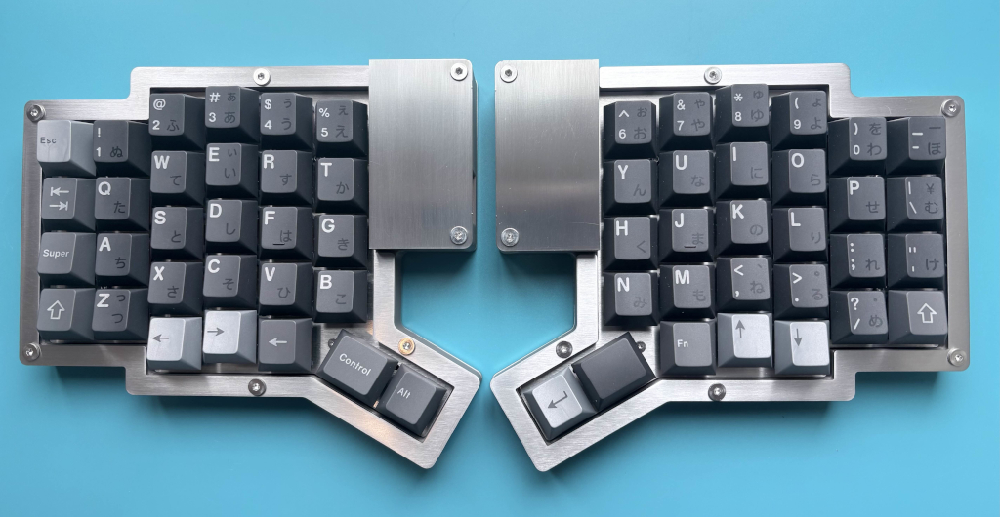
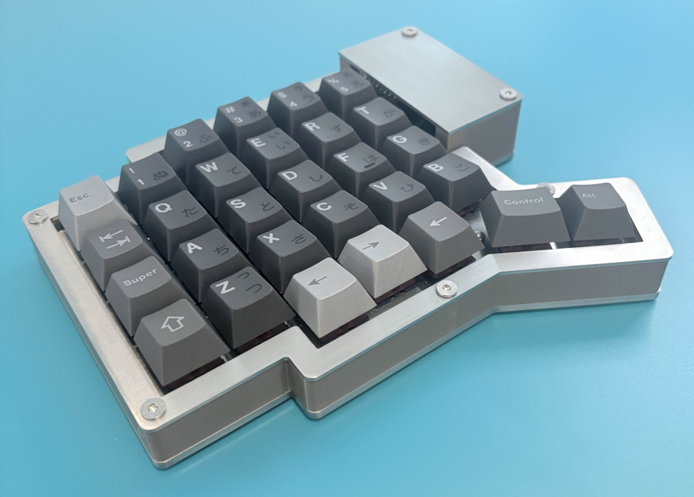

Pictured is my Pando58 keyboard built with a stainless steel sheet metal case, 3D printed middle section and a stainless steel switch plate. The keycaps are [Keykobo Nichirin](https://divinikey.com/products/keykobo-nichirin-keycaps) with the Base and 40s sets.

This post serves as an overview and provides details surrounding the development process.

The [official repo](https://github.com/jyap808/pando58) can be found on GitHub, which contains Ergogen source files, FreeCAD design files and firmware.

The [official documentation](https://jyap808.github.io/pando58/) includes a BOM, build guide, firmware guide, and gallery.

I have made PCB kits available on [my Etsy page](https://www.etsy.com/shop/ReplicantWorks). Purchases help to support the project and encourage further development for further models.

## Background reading

Pando58 is largely a flat layout version of my Cosmos Dactyl keyboard. Check out most of the journey taken so far in [my previous blog post](./2025-11-16-1763340628/).

In that post, I concluded with the future iteration ideas:
* Changing the TRRS connection for something that does not [short](https://old.reddit.com/r/olkb/comments/18uf6nj/rp2040_split_keyboard_data_line_halfduplex_with/kinff4o/).
* Building a flat travel version. Perhaps single unit.
* Designing and making a flat PCB version.
* Making a RP2040 version (cheaper and more modern MCU with increased storage, enabling more features).
* Performing the multi-stage [full VIA support work flow](https://github.com/the-via/keyboards/blob/master/README.md#getting-via-to-support-your-keyboard).

While I didn't explicitly set out to achieve all of those points, I managed to achieve all of them except for the VIA/QMK support work flow. I did put in a Pull Request to have my firmware for that keyboard included in the QMK repository. While I addressed all the PR comments, the [PR is still open](https://github.com/qmk/qmk_firmware/pull/25799#issuecomment-3797740154) so I'm not holding my breath that it will get merged.

## Inspiration

While not being directly inspired by other keyboards, it can be seen as similar to other keyboards like the Silakka54, Lily58, Sofle and ErgoDox.

### Name

Pando58 is named after the [Pando tree](https://youtu.be/SwBgSbPvg7Q). I had found out from a [really cool presentation](https://neal.fun/size-of-life/) that Pando was the Earth's largest organism by mass.

This idea maps nicely onto split keyboards. At first glance, a split keyboard looks like two separate devices. But electrically and functionally, they operate as one system: two halves connected together to behave as a single keyboard.

The name Pando58 reflects that concept. Like the Pando colony, the keyboard is composed of multiple visible parts that are actually one coherent organism working together. The two halves mirror each other, share firmware architecture, and communicate continuously.

## Background - Linear experimentation and progress

### Handwired prototype

Along the way I had found [Ergogen](https://github.com/ergogen/ergogen) which is a "declarative language for generating ergonomic keyboards".

I ran through [a tutorial](https://flatfootfox.com/ergogen-introduction/) which gave me the DXF outline files I needed.

I handwired it up and created a simple case for it in FreeCAD.

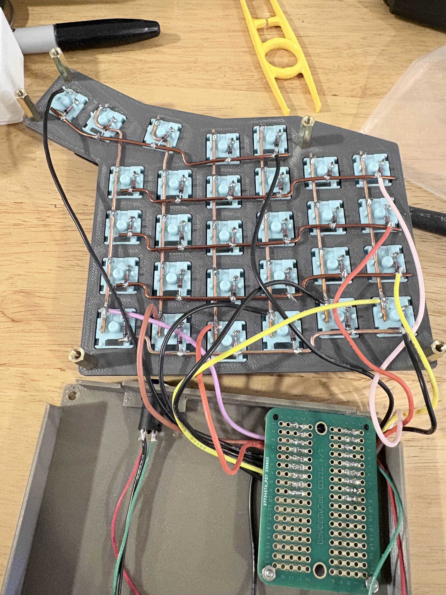

The final look came out like this:

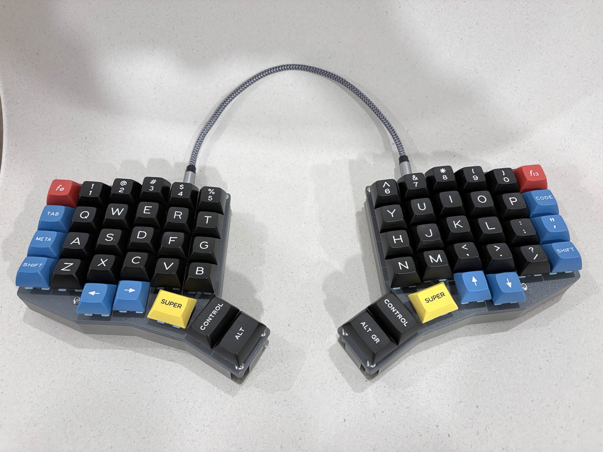

This allowed me to test out the layout and day-to-day functionality.

This layout used a 1.25U and 2x 1.5U keys in a vertical arrangement for the thumb cluster.

Quite a few split keyboards use a thumb key in a vertical arrangement. I had assumed it would be perfectly fine but a lot of these split keyboards also support lower profile keycaps which are flatter. When testing this keyboard day to day, I realized that MX keycaps don't work as well in a vertical arrangement as it goes against the designed sculpting of them.

I came to the conclusion that having MX keycaps in a vertical arrangement wasn't ideal.

### Corne PCB

Sometimes you need to buy something to learn a few things.

I bought a low profile [Corne](https://github.com/foostan/crkbd).

This went terribly wrong and I didn't end up with a fully working keyboard. This was partly my fault as I had soldered the MCU on the wrong side on one PCB and removing the MCU destroyed too many traces.

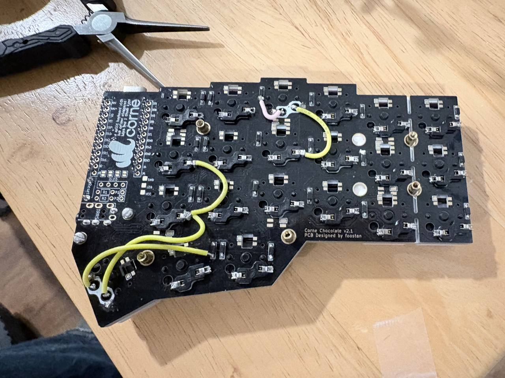

While I avoided the MCU mistake on the second PCB, I ran into another issue during assembly.

When installing the low-profile Kailh Choc v1 switches, the insertion force caused several hotswap sockets to lift off the PCB, in some cases ripping the solder pads off entirely. This was extremely frustrating and required manually wiring multiple connections to repair the damage.

The root cause is the very small gap between the switch plate and the PCB when using Choc switches. Because the switch body sits so close to the PCB, the force applied when pressing switches into the plate is transferred almost directly into the hotswap socket and its solder pads.

In retrospect, I probably could have avoided this issue if I had pressed the hotswap socket down when inserting the switch.

With MX-style switches, this problem is far less common. MX switches have a taller housing and therefore create a larger clearance between the plate and the PCB, which reduces the amount of direct pressure applied to the hotswap sockets during installation.
This was also my first experience soldering SMT (surface mount technology) diodes. I didn't make any mistakes but it made me realize the relative difficulty of soldering them compared to THT (through-hole technology) diodes.

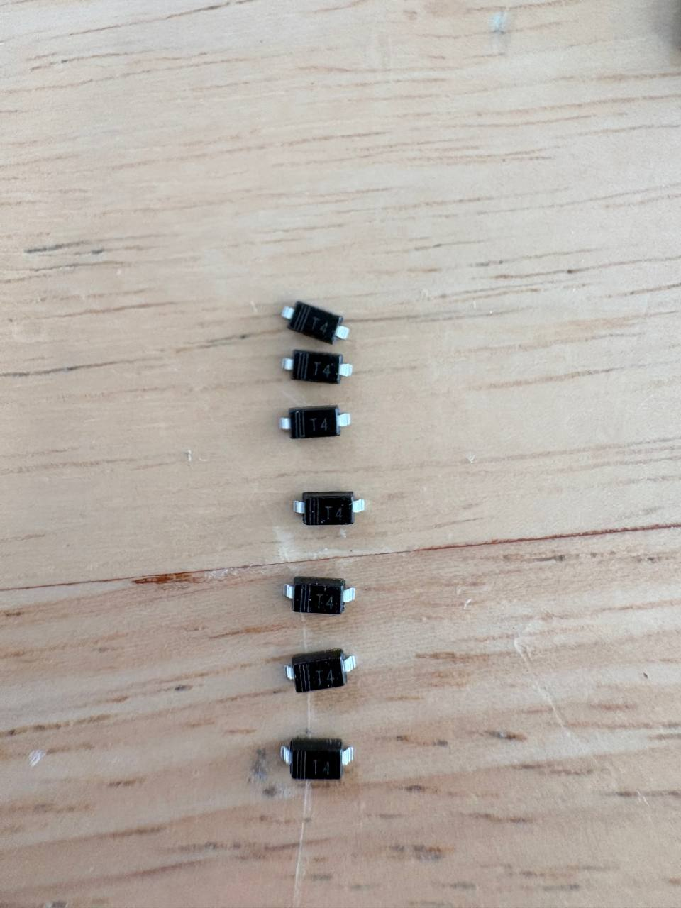

SMT diodes are so small I needed to use the macro feature of my phone to make sure they were aligned OK.

This Corne also supported LEDs; utilized a reversible PCB; had a tray mount design and optionally supported an OLED screen. This gave me a good feel for the features, implementation and things I would want to change on a popular split keyboard.. This gave me a good feel for a popular split keyboard.

### Pando58 version 1.0 - My first PCBs

I continued on with Ergogen and created version 1.0 of my PCB.

This allowed me to try out ordering PCBs for the first time. I ordered some from JLCPCB in China and from OshPark in the US.

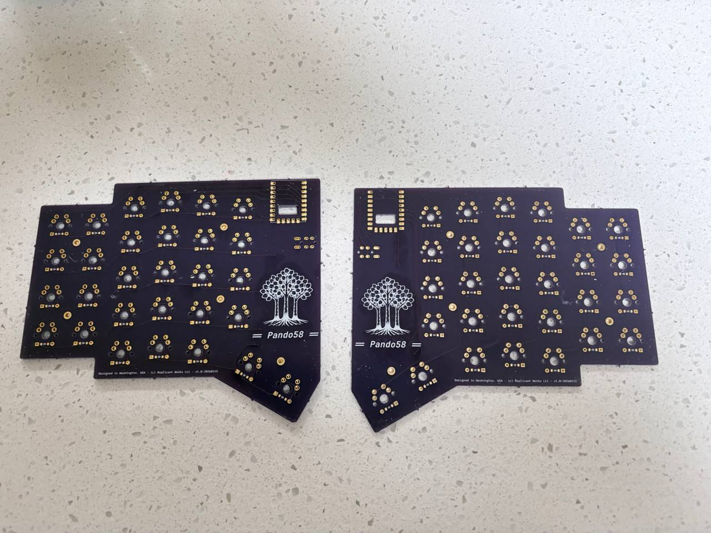

Pictured above are the PCBs from OshPark.

This version had:
* MX solder-only switches
* Reversible PCB (each PCB supports either left or right side)
* A 3rd party Ergogen footprint for the RP2040 Zero (I would later revise this footprint)
* TRRS for interconnect
* PCB mount

This version essentially worked but I could immediately see changes I wanted to make.

It gave me a good grasp of the PCB ordering process and working with KiCAD.

I realized that ordering PCBs of this size in the US is cost-prohibitive, slower and of no real benefit.

### Version 1.2

Version 1.1 contained most of the changes I wanted from version 1.0. The only difference from version 1.1 to 1.2 is that I wasn't happy with the thumb cluster screw mount position so I added a screw and shifted one over, moving from 4 to 5 screw mount points.

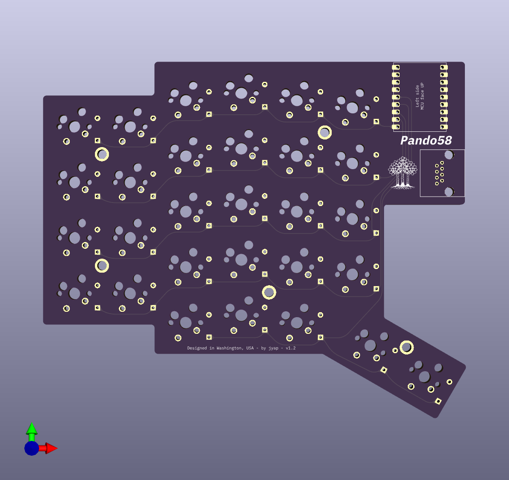

Above is the front of the left side PCB.

Compared to version 1.0 you can see:
* Tighter edge margins
  * A cut out area was put in under the MCU and RJ45 since that didn't need to be mostly empty PCB space. The main takeaway was that having a smaller PCB was preferable to keep manufacturing costs down but it also allows for a tighter case design.
* RJ45 interconnect
  * I created my own CAD footprint since there wasn't one available for Ergogen.
* Switch from PCB mount to tray mount
  * The v1.0 version was PCB mount because I was following the tutorial which used this mount system.
* Dedicated left and right PCBs
  * While there was a way to make a reversible PCB (which I did in version 1.0), keeping it reversible also complicates the design, which can make it more difficult to assemble.
* Solder and hotswap compatible switches.
  * Having dedicated left and right PCBs meant this wasn't as cumbersome on the PCB to support.

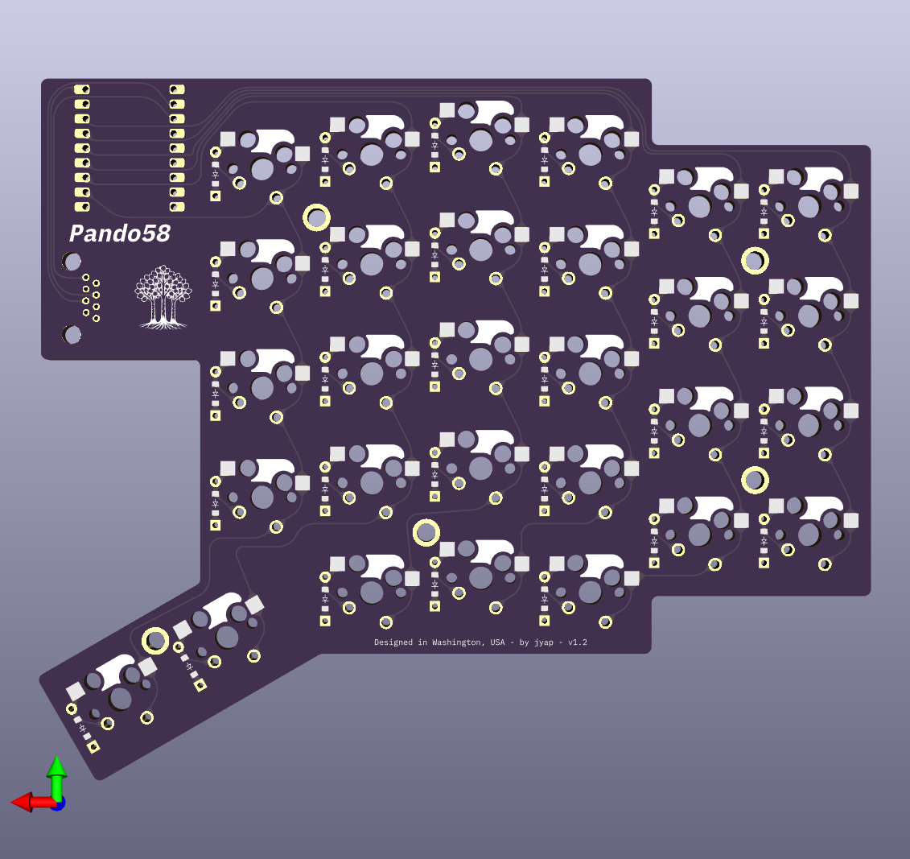

Above is the back of the left side PCB. I also spent a lot of time mapping out the traces in the Ergogen configuration in a declarative manner. While it took a long time, it meant that my traces could be very uniform and precise.

I utilized KiCAD's Round Tracks plugin to provide aesthetically pleasing round tracks.

## Keycaps

Something to take into consideration when designing a keyboard layout is the availability of purchased keycaps.

Having more esoteric and varied keycap sizes makes it difficult to match available keycaps with layouts.

The easiest solution is to make all the keycaps 1U size and utilizing a keycaps with uniform heights (such as DSA or PBS profile). When using a standard set with varied row heights, the alphabetic and numeric keycaps are utilized in Pando58, however a "normie" base set won't have some of the side edge keys.

This post covers the default layout of Pando58.

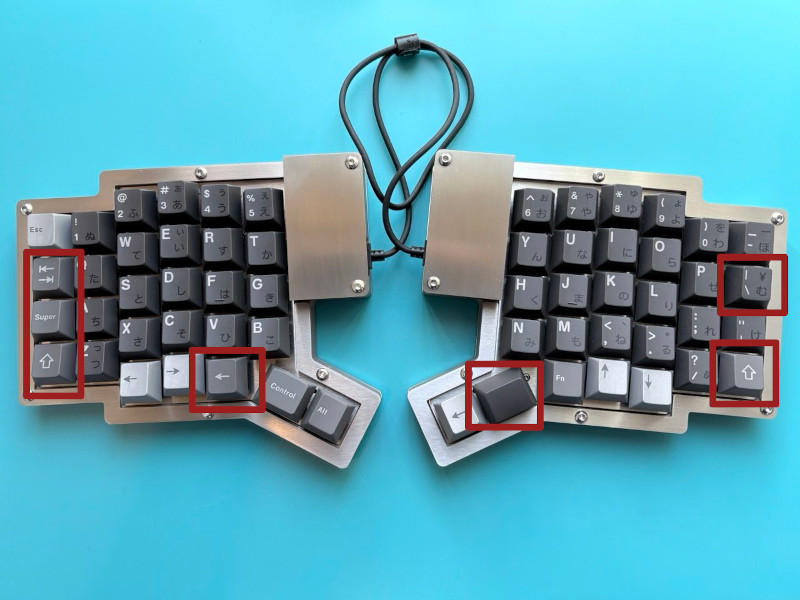

The above picture higlights the keys which are different from the base set of a typical keycap set.

When looking at a base set you often lack:
* 1U Row 2 height Tab key
* 1U System/Super key in Row 3. A 1U System/Super key often comes in Row 4.
* 2 x 1U Shift keys.
* 1U "|" key in Row 2. A 1U "|" key often comes in Row 1 or Row 3.
* 1U Row 4 Backspace key. Base sets often come with 2 styles of cursor keys so a Left arrow key works fine here as well.
* 1.25U or 1U Spacebar key 

Often these keys can be satisfied with an Ergo/Ortho/40s kit or an extra novelty set. Standalone base Ergo/Ortho/40s kits as found in PBS keycap sets are nicely kitted out. At a stretch you can also just use spare keys from the base set if you don't mind the legends of keys mis-matching their functionity. Naturally blank keys work perfectly fine as well.

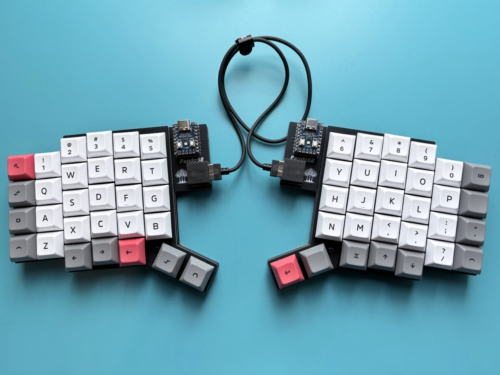

The above picture shows a typical uniform DSA keycap ortho set. All the keys are covered. In this case, I switched out some right side keys for grey keys to keep it aesthetically symmetrical. Ortho sets often do not have 1.25U keys so the Control key and Spacebar are 1U keys.

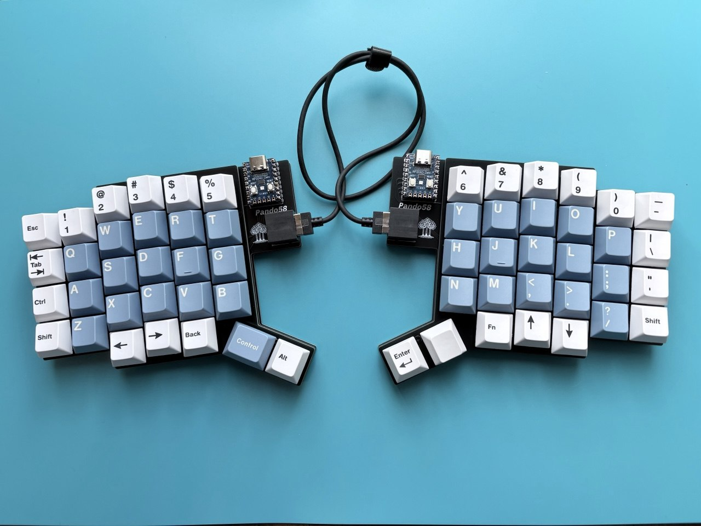

The above picture shows GMK Godspeed Columbia keycaps for the light blue keycaps. The other keycaps are from the [Cherry Icebergo PBT set from Keeb.io](https://keeb.io/products/cherry-icebergo-pbt-keyset). The modifier kit that they have pairs perfectly with any Cherry profile keycap set.

## Keymap Layout

Pando58 supports a ton of features since it uses Vial firmware and RP2040 Zero MCUs which are not storage constrained.

Here is the default 2-layer keymap layout. Layouts can be highly personal so consider this just a guide to what I use and set as the Pando58 default.

The keymap design philosophy of Pando58 is that most of the functionality of a keyboard should be available with the base layer. Many split keyboards omit the number row or cursor arrow keys, which the Pando58 does not.

Base layer:

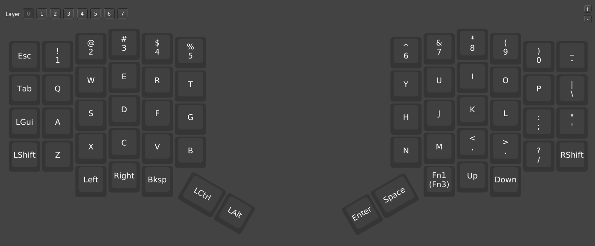

Layer 1:

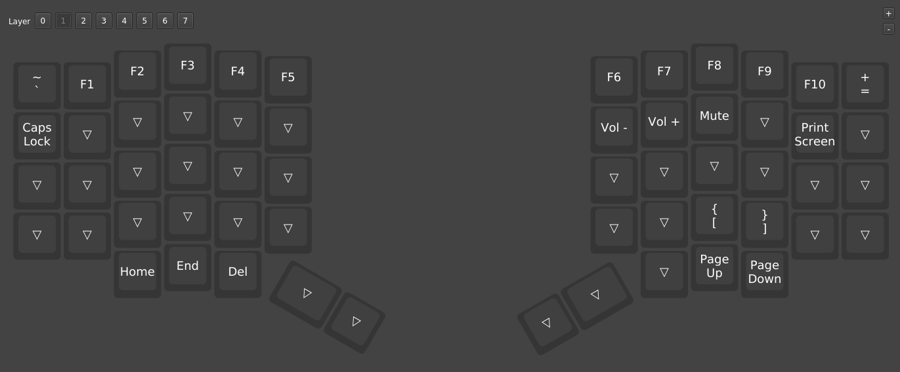

## Future iterations

Pando58 fulfills the design goals I wanted to achieve. It is simple to build, practical and reliable. It forms a good base to iterate on.

Hopefully Pando58 resonates with others.

Future iteration paths include:

* Lower profile keycap version
* Integrated MCU design
* Unified split version

## Additional resources

* [Koala52](https://github.com/larssont/koala52) - Pando58 drew inspiration from the Ergogen dedicated left and right PCB layout of the Koala52
